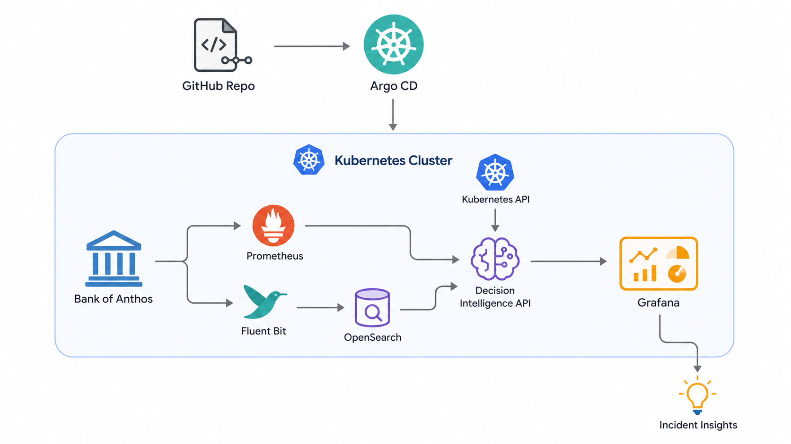

# SRE Decision Intelligence Platform



A GitOps-driven Kubernetes SRE platform that turns raw telemetry into actionable incident decisions.

## Problem

Modern cloud-native systems generate massive amounts of telemetry:

- Metrics
- Logs
- Kubernetes events
- Traces
- Deployment signals
- Security events

But during incidents, teams often still struggle to answer the most important operational questions:

- What changed?
- Who is affected?
- Where is the failure spreading?
- What is the likely root cause?
- What action is safe now?

This project focuses on moving from observability data collection to decision intelligence.

## Goal

Build a production-style SRE Decision Intelligence Platform for Kubernetes.

The platform uses:

- Bank of Anthos as the realistic workload
- Prometheus for SLI/SLO metrics
- Fluent Bit for log collection
- OpenSearch for log search and investigation
- Kubernetes API for runtime context
- Argo CD for GitOps and deployment-change awareness
- Grafana for dashboards and incident visibility
- A custom Decision Intelligence API for signal correlation and safe action recommendations

## High-Level Flow

```text
SLO breach
   ↓
Prometheus detects user-impact symptom
   ↓
Decision Intelligence API collects evidence
   ↓
OpenSearch provides log context
   ↓
Kubernetes API provides runtime state
   ↓
Argo CD provides deployment-change context
   ↓
Incident summary is generated
   ↓
Grafana displays impact, root cause, and safe action
```

---

## Core Data Sources

| Source             | Tool                    | Purpose                             |
| ------------------ | ----------------------- | ----------------------------------- |
| Metrics            | Prometheus              | SLO symptoms, latency, availability |
| Logs               | Fluent Bit → OpenSearch | Error evidence and service behavior |
| Runtime context    | Kubernetes API          | Pods, deployments, events, restarts |
| Deployment context | Argo CD                 | GitOps sync status, changes, drift  |
| Visualization      | Grafana                 | Dashboards and incident summaries   |


---

## Target Outcome
### The platform should help answer:

```text
Incident: Banking transaction degradation

Impact:
Users cannot reliably complete transactions.

Evidence:
Frontend 5xx errors increased.
Transaction service latency increased.
Backend service logs show database connection errors.
A new deployment was synced recently by Argo CD.

Likely Root Cause:
Database connection exhaustion in the transaction backend.

Safe Action:
Check recent rollout, inspect connection pool configuration, and scale only if resource saturation is confirmed.
```